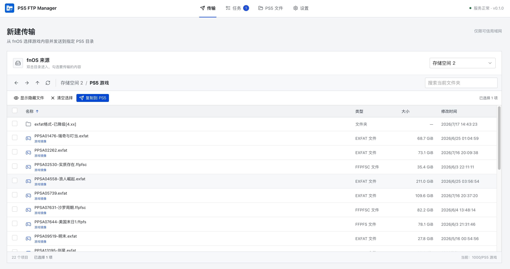
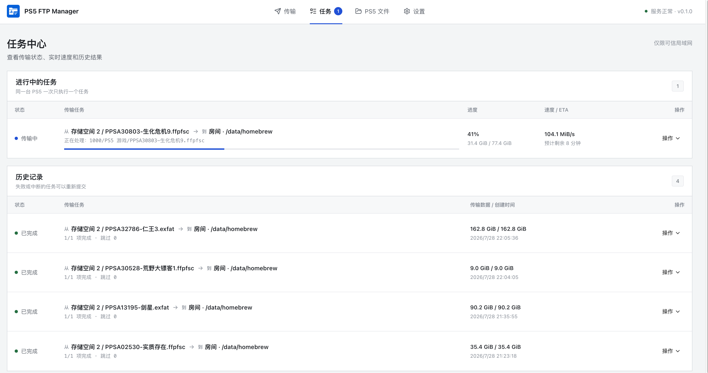
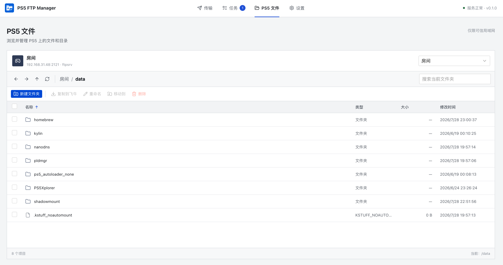

<p align="center">
  
</p>

<p align="center">
  <b>PS5 FTP Manager</b><br/>
  A graphical fnOS app for transferring and managing files between a NAS and PS5 FTP servers
</p>

<p align="center">
  <a href="README_ZH.md">简体中文</a>
  ·
  <b>English</b>
</p>

<p align="center">
  <b><a href="#features">Features</a></b>
  ·
  <b><a href="#install">Install</a></b>
  ·
  <b><a href="#usage">Usage</a></b>
  ·
  <b><a href="#screenshots">Screenshots</a></b>
  ·
  <b><a href="#build">Build</a></b>
  ·
  <b><a href="#acknowledgement">Acknowledgement</a></b>
</p>

---

<p align="center">
  <a href="https://github.com/aydencharles/ps5-ftp-fnOS/releases"></a>
  <a href="https://github.com/aydencharles/ps5-ftp-fnOS/stargazers"></a>
  <a href="https://github.com/aydencharles/ps5-ftp-fnOS/network/members"></a>
  <a href="LICENSE"></a>
  
  
  
</p>

<p align="center">
  A third-party <b>fnOS</b> app (<code>.fpk</code>) for uploading folders and game images to a PS5,<br/>
  downloading PS5 files to fnOS, and managing remote files through <b>zftpd</b> or <b>ftpsrv</b>.
</p>

<br>

# Screenshots

<div align="center">
  <a href="assets/screenshots_01.png">
    
  </a>
  <a href="assets/screenshots_02.png">
    
  </a>
  <a href="assets/screenshots_03.png">
    
  </a>
</div>

<p align="center"><sub>fnOS storage browser &nbsp;·&nbsp; Real-time transfer tasks &nbsp;·&nbsp; PS5 file manager</sub></p>

<br>

# Features

A focused PS5 file-transfer manager for NAS workflows — no FTP mounts or external transfer tools required.

- **Bidirectional transfers** — upload from fnOS to PS5 or download from PS5 into a selected Library Root
- **Friendly local browser** — displays fnOS storage locations without exposing internal paths such as `/vol2/1000/...`
- **Independent 7z extraction** — extracts ordinary `.7z` files or `.7z.001` split sets on fnOS, with password support, safe atomic publication, progress, cancellation, and retry
- **Game-aware selection** — recognizes folders containing `eboot.bin` and `.exfat`, `.ffpfs`, `.ffpfsc`, and `.phu` images while allowing arbitrary files and folders
- **Persistent task queue** — SQLite-backed tasks with cancellation, retry, removable history, real byte progress, smoothed speed, and ETA
- **Controlled concurrency** — one active task per PS5, parallel tasks across profiles, and 1–4 file connections per task
- **Safe replacement** — temporary files, size verification, rollback-aware replacement, and in-attempt REST/STOR or REST/RETR resume
- **Remote file manager** — browse, search, create directories, rename, move, download, and permanently delete PS5 files
- **Native fnOS UI** — Vue 3, TypeScript, Pinia, LESS, TDesign Vue Next, and Lucide in an fnOS iframe

<br>

# Install

### Requirements

1. **fnOS** (x86_64)
2. A PS5 running a reachable FTP server:
   - **zftpd** (console server commonly uses port `2120`)
   - **ftpsrv** (commonly uses port `2121`)
3. A trusted local network; a wired connection between the PS5 and NAS is recommended

> [!WARNING]
> The app runs as root so it can access fnOS storage volumes, and its HTTP service intentionally has no login authentication.  
> Use it only on a trusted LAN. Never expose port **8100** to the Internet.

### Package

1. Download the latest `.fpk` from [Releases](https://github.com/aydencharles/ps5-ftp-fnOS/releases)  
   (or build one yourself — see [Build](#build)).
2. Install the third-party package in the fnOS **App Center**.
3. Launch **PS5 FTP Manager**.

The service listens on port **8100** (`service_port` in `manifest`).

<br>

# Usage

### Connect to a PS5

1. Start zftpd or ftpsrv on the PS5 and note its IP address and port.
2. Open **Settings** and add a PS5 profile.
3. Choose the matching preset, enter the host, credentials, and allowed base path, then save it.
4. Run the connection test before creating a transfer.

FTP traffic is unencrypted and uses passive mode. Older PS5 firmware may write slowly to internal `/data` because of the PFS encryption driver; external USB storage is usually faster.

### Transfer files

1. Open **New Transfer**.
2. Select one or more files or folders from an fnOS Library Root.
3. Select a PS5 profile, destination directory, and conflict policy.
4. Create the task and follow its progress, current file, speed, and ETA in **Tasks**.
5. To copy in the other direction, select items in **PS5 Files**, choose **Download**, and select an fnOS destination.

You can cancel queued or running tasks, retry terminal tasks, and remove finished history records. Removing a task record never deletes transferred files.

### Extract 7z archives on fnOS

1. In **New Transfer**, select one ordinary `.7z` file or the first volume of a split archive (`.7z.001`). Later volumes such as `.002` are discovered automatically and cannot be selected as an extraction source.
2. Choose **Extract**, select an fnOS parent directory, and enter the archive password when required.
3. Optionally enable source-volume deletion. It is disabled by default and runs only after the destination has been published successfully.
4. Follow the independent extraction queue under **Tasks → Extraction Tasks** or in the floating task center.

Each task creates a new directory named after the archive. Archive paths are scanned before writing; absolute paths, traversal, duplicate targets, symbolic links, and special files are rejected. Output is written to a hidden staging directory and atomically published without merging or overwriting an existing destination. The archive's internal directory structure is preserved. Extraction runs one task at a time independently of PS5 transfers.

### Conflict policies

| Policy | Behavior |
| --- | --- |
| Smart | Skip same-size files and safely replace files with a different size; default policy |
| Overwrite all | Transfer every same-name file again and safely replace it |
| Stop on conflict | Fail the task as soon as a same-name file is found |

Directories are merged non-destructively; extra destination files are not removed. Uploads and downloads are written to sibling temporary files, size-checked, and then promoted to their final names.

If the service restarts, running tasks become **interrupted** and are not resumed automatically; tasks that were queued but not started remain queued. Retrying creates a new attempt and rescans the source.

<br>

# Build

```shell
git clone https://github.com/aydencharles/ps5-ftp-fnOS.git
cd ps5-ftp-fnOS
```

### Dependencies

| Dependency | Purpose |
| --- | --- |
| Go 1.26 | Build the backend; required by `github.com/jlaffaye/ftp v0.2.1` |
| Node.js 22+ and pnpm 10+ | Check and build the Vue frontend |
| `fnpack` / fnOS packaging toolchain | Produce an installable `.fpk` |

With `GOTOOLCHAIN=auto`, an older Go installation can automatically obtain the required Go toolchain.

### Tests

```shell
# Backend unit tests
go test ./src/backend/... -count=1

# fnOS start / status / stop lifecycle test
./scripts/test-lifecycle.sh

# Frontend checks
pnpm --dir src/frontend install --frozen-lockfile
pnpm --dir src/frontend lint
pnpm --dir src/frontend typecheck
pnpm --dir src/frontend test
```

### Package build

```shell
# Recommended: run all checks, build frontend and linux/amd64 backend, stage the app, then package → dist/
./scripts/build.sh

# Build and stage only when fnpack is unavailable
SKIP_FNPACK=1 ./scripts/build.sh

# Skip checks (not recommended; the frontend production build still runs)
SKIP_TEST=1 ./scripts/build.sh
```

Common environment variables:

| Variable | Default | Description |
| --- | --- | --- |
| `DIST_DIR` | `$PROJECT_ROOT/dist` | Build output directory |
| `PACKAGE_DIR` | `$PROJECT_ROOT/packaging` | fnpack project directory |
| `GOOS` / `GOARCH` | `linux` / `amd64` | Go build target |
| `FNPACK` | `fnpack` | fnpack executable |
| `SKIP_FNPACK` | `0` | Set to `1` to skip `.fpk` packaging |
| `SKIP_TEST` | `0` | Set to `1` to skip backend, lifecycle, and frontend checks |

### Outputs

| Path | Description |
| --- | --- |
| `dist/server` | Static backend binary for the selected Go target |
| `dist/*.fpk` | Installable fnOS package |
| `packaging/app/` | Staged runtime tree produced by the build |

> [!TIP]
> `dist/` and `packaging/app/` are build outputs — distribute release binaries through [Releases](https://github.com/aydencharles/ps5-ftp-fnOS/releases).

### Local development

```shell
# Install dependencies and build the frontend first
pnpm --dir src/frontend install
pnpm --dir src/frontend build

# Start the backend at http://localhost:8100 using .dev-data/
./scripts/dev.sh
```

| Method | Endpoint | Description |
| --- | --- | --- |
| `GET` | `/healthz` | Process and SQLite health |
| `GET` | `/api/v1/bootstrap` | Initial UI snapshot |
| `GET/POST/PUT/DELETE` | `/api/v1/profiles` | PS5 profile management |
| `POST` | `/api/v1/profiles/{id}/test` | Connection and listing test |
| `GET` | `/api/v1/library/roots` | Friendly fnOS storage locations |
| `GET` | `/api/v1/library/entries` | Read-only local browser |
| `GET` | `/api/v1/ps5/{id}/entries` | PS5 directory browser |
| `POST` | `/api/v1/ps5/{id}/operations` | Create, rename, move, or delete remote entries |
| `GET/POST` | `/api/v1/tasks` | List or create transfer tasks |
| `GET/DELETE` | `/api/v1/tasks/{id}` | Read a task or remove its terminal record |
| `POST` | `/api/v1/tasks/{id}/cancel` | Cancel a task |
| `POST` | `/api/v1/tasks/{id}/retry` | Retry a terminal task |
| `GET` | `/api/v1/events` | SSE task snapshot stream |
| `GET/POST` | `/api/v1/extraction-tasks` | List or create independent 7z extraction tasks |
| `GET/DELETE` | `/api/v1/extraction-tasks/{id}` | Read an extraction task or remove its terminal record |
| `POST` | `/api/v1/extraction-tasks/{id}/cancel` | Cancel a queued, scanning, or extracting task |
| `POST` | `/api/v1/extraction-tasks/{id}/retry` | Retry a terminal extraction task with a new password |
| `GET` | `/api/v1/extraction-events` | SSE extraction-task snapshot stream |
| `GET/PUT` | `/api/v1/settings` | Read or update transfer concurrency |

The Library API accepts only `{root_id, path}` locators, never client-supplied fnOS absolute paths. The backend resolves symbolic links and rejects paths that escape a Library Root. PS5 operations are similarly confined to each profile's base path.

### Runtime environment variables

Paths and ports prefer fnOS-injected variables, with development overrides where appropriate.

| Variable | Purpose |
| --- | --- |
| `TRIM_APPDEST` / `APP_DIR` | Application directory |
| `TRIM_PKGVAR` / `DATA_DIR` | Persistent data directory for SQLite, key, PID, and logs |
| `TRIM_PKGTMP` / `TEMP_DIR` | Temporary data directory |
| `TRIM_SERVICE_PORT` / `PORT` / `SERVICE_PORT` | Listen port (default `8100`) |
| `UI_DIR` | Built frontend directory |
| `LISTEN_ADDR` / `BIND_ADDR` | Bind address (default `0.0.0.0`) |

`packaging/cmd/main` exports the fnOS runtime values and manages the server process.

### Repository layout

```text
.
├── src/
│   ├── backend/             Go HTTP API, FTP/7z services, SQLite store, and independent queues
│   └── frontend/            Vue 3 / TypeScript / TDesign frontend
├── packaging/               fnpack metadata, privileges, UI config, and lifecycle scripts
├── scripts/                 Development, lifecycle test, and one-shot build scripts
├── docs/adr/                Architecture decision records
├── CONTEXT.md               Domain terminology
├── THIRD_PARTY_NOTICES.md   Third-party license notices
├── go.mod
└── README.md
```

<br>

# Troubleshooting

1. Confirm the PS5 FTP server is running and that its IP address and port are reachable from fnOS.
2. Check that the profile preset, credentials, and base path match the FTP server.
3. Keep the PS5 and NAS on the same trusted LAN; prefer wired networking for large game images.
4. Check the task error and `${TRIM_PKGVAR}/server.log` for backend details.
5. Search existing reports in [Issues](https://github.com/aydencharles/ps5-ftp-fnOS/issues), then include the fnOS version, PS5 FTP server, app version, logs, and reproduction steps in a new report.

<br>

# Contributing

- Open an issue before large features to avoid duplicated work.
- Keep changes focused and match the existing code style.
- Validate with `./scripts/build.sh` (or `SKIP_FNPACK=1 ./scripts/build.sh`) before submitting.
- Pull requests are welcome on the active development branch.

<br>

# Acknowledgement

Built with open-source libraries and the fnOS third-party application framework.

- [jlaffaye/ftp](https://github.com/jlaffaye/ftp) — FTP client and transfer primitives
- [bodgit/sevenzip](https://github.com/bodgit/sevenzip) — pure-Go 7z and split-volume reader
- [modernc.org/sqlite](https://pkg.go.dev/modernc.org/sqlite) — pure-Go persistent task and profile storage
- [Vue](https://vuejs.org/), [TDesign Vue Next](https://github.com/Tencent/tdesign-vue-next), and [Lucide](https://lucide.dev/) — Web UI
- **fnOS** third-party app framework

See [THIRD_PARTY_NOTICES.md](THIRD_PARTY_NOTICES.md) for dependency licenses.

<br>

# License

This project is licensed under the [GNU General Public License v3.0](LICENSE).

Third-party components keep their own licenses; see [THIRD_PARTY_NOTICES.md](THIRD_PARTY_NOTICES.md).

> Unofficial tool; **not affiliated with** Sony Interactive Entertainment.  
> “PlayStation”, “PS5”, and related marks are trademarks of their respective owners.  
> Intended for personal backups and management of content you legally own. Use at your own risk. No warranty.
